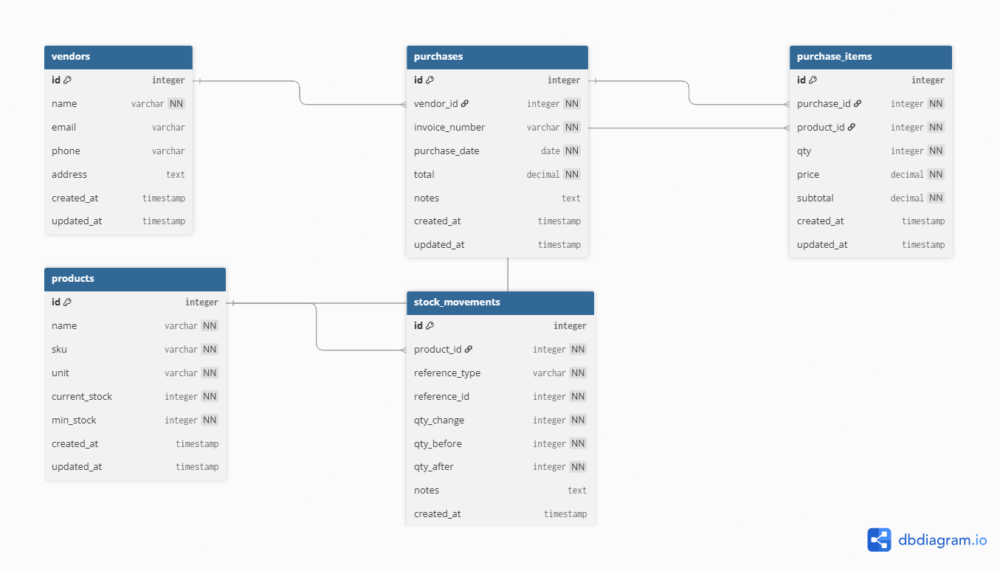

# Inventory API

A RESTful API for a simple inventory management system built with Laravel 12. Submitted as part of a Backend PHP Developer technical assessment.

## Tech Stack

- **PHP** 8.2+
- **Laravel** 12
- **MySQL** / MariaDB
- **Pest** for testing

## Features

- Purchase management with full database transaction support
- Automatic stock tracking on every purchase
- Complete stock movement history per product
- Minimum stock alert field per product
- Purchase summary report with raw SQL query
- Date range and vendor filtering on reports

## Requirements

- PHP 8.2 or higher
- Composer
- MySQL 5.7.5+ or MariaDB
- Node.js (for asset build only)

## Getting Started

**1. Clone the repository**

```bash
git clone https://github.com/krisnadwinugraha/inventory-api.git
cd inventory-api
```

**2. Install dependencies**

```bash
composer install
```

**3. Configure environment**

```bash
cp .env.example .env
php artisan key:generate
```

Open `.env` and set your database credentials:

```env
DB_CONNECTION=mysql
DB_HOST=127.0.0.1
DB_PORT=3306
DB_DATABASE=inventory_api
DB_USERNAME=root
DB_PASSWORD=your_password
```

**4. Run migrations and seeders**

```bash
php artisan migrate --seed
```

This will create all tables and seed 5 vendors and 10 products.

**5. Start the development server**

```bash
php artisan serve
```

The API will be available at `http://localhost:8000`.

## API Endpoints

### Purchase

| Method | Endpoint | Description |
|--------|----------|-------------|
| POST | `/api/purchase` | Create a new purchase |

**Request body:**
```json
{
    "vendor_id": 1,
    "invoice_number": "INV-0001",
    "purchase_date": "2026-02-28",
    "notes": "Optional notes",
    "items": [
        {
            "product_id": 1,
            "qty": 10,
            "price": 50000
        }
    ]
}
```

### Reports

| Method | Endpoint | Description |
|--------|----------|-------------|
| GET | `/api/report/purchase-summary` | Purchase summary per vendor |

**Query parameters:**

| Parameter | Type | Required | Description |
|-----------|------|----------|-------------|
| start_date | date | Yes | Start of date range (Y-m-d) |
| end_date | date | Yes | End of date range (Y-m-d) |
| vendor_id | integer | No | Filter by specific vendor |

**Example:**
```
GET /api/report/purchase-summary?start_date=2026-01-01&end_date=2026-12-31&vendor_id=1
```

### Debug

| Method | Endpoint | Description |
|--------|----------|-------------|
| GET | `/api/debug/sql-analysis` | SQL bug analysis for assessment Part 4 |

## Database

The database export is included in the repository root as `inventory_api.sql`.

To import manually:

```bash
mysql -u root -p inventory_api < inventory_api.sql
```

### Entity Relationship Diagram



## Postman Collection

Import `InventoryAPI.postman_collection.json` into Postman. The collection includes:

- 11 purchase requests (happy path and all failure cases)
- 9 report requests (with and without filters, plus validation failures)
- 1 SQL debug analysis request

The base URL is set as a collection variable `{{base_url}}` defaulting to `http://localhost:8000/api`. Change it in one place if your port differs.

## Project Structure

```
app/
├── Http/
│   ├── Controllers/
│   │   └── Api/
│   │       ├── PurchaseController.php
│   │       ├── ReportController.php
│   │       └── DebugController.php
│   └── Requests/
│       ├── StorePurchaseRequest.php
│       └── PurchaseSummaryRequest.php
├── Models/
│   ├── Vendor.php
│   ├── Product.php
│   ├── Purchase.php
│   ├── PurchaseItem.php
│   └── StockMovement.php
└── Services/
    ├── PurchaseService.php
    └── ReportService.php
```

## Running Tests

```bash
php artisan test
```

## Submission Notes

- Raw SQL is used in `ReportService::purchaseSummary()` via `DB::select()` as required
- Database transactions with `lockForUpdate()` are used in `PurchaseService::store()` to prevent race conditions on concurrent stock updates
- All validation is handled via FormRequest classes
- See `assessment_explanation.pdf` for full reasoning on database design, index strategy, and SQL decisions
